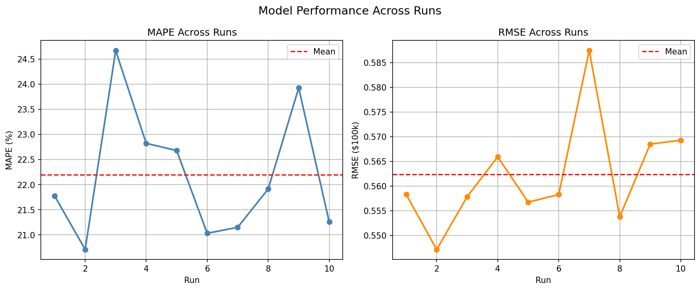

# California Housing Price Predictor

Fourth machine learning project. Using neural networks to predict housing prices in California based on the sklearn California Housing database. 

---

## Results

**Before tuning**


---

## Architecture

```
Input (8) → Linear(64) → ReLU → Linear(32) → ReLU → Linear(16) → ReLU → Output(1)
```